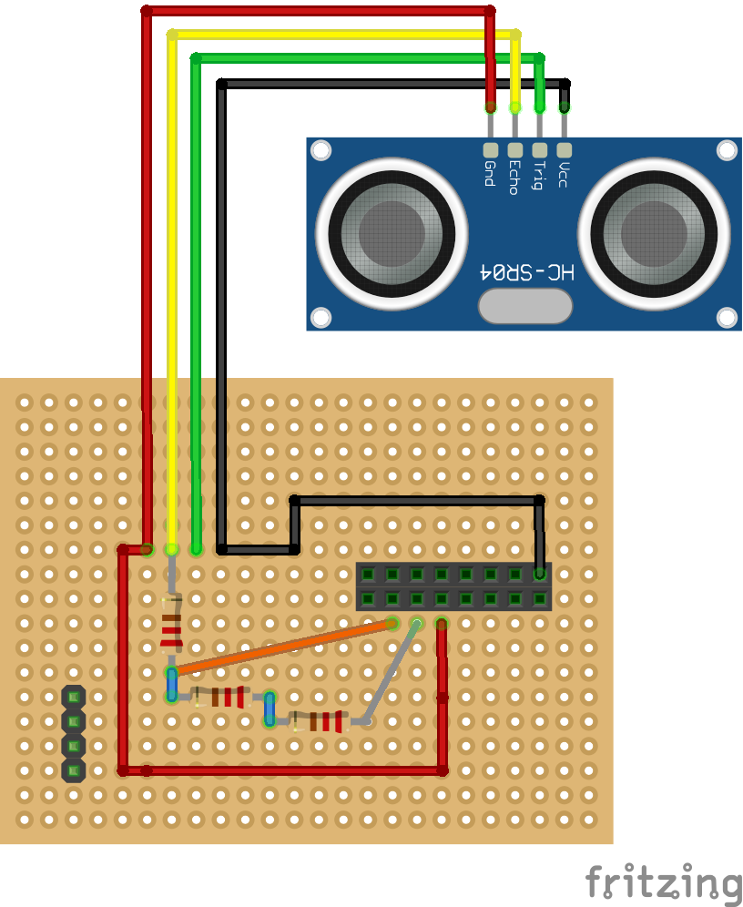
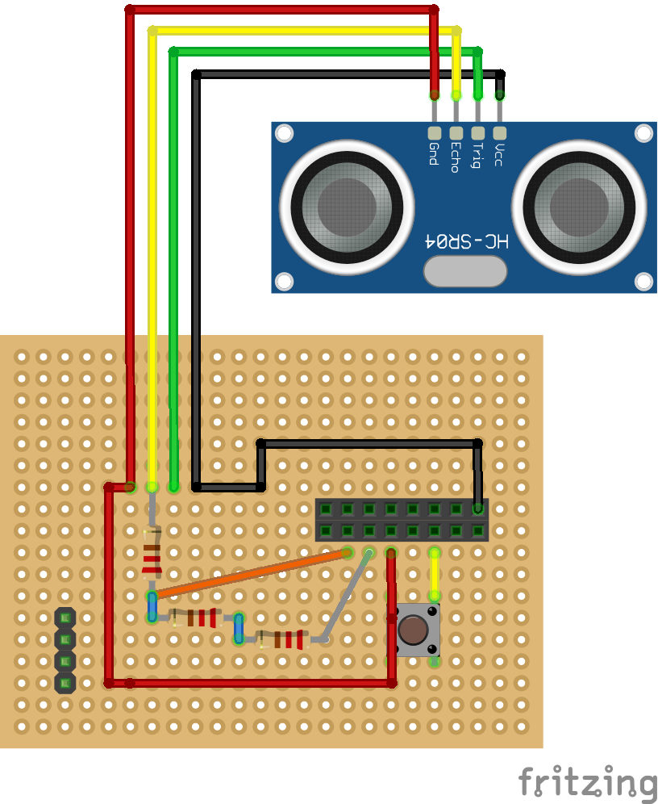
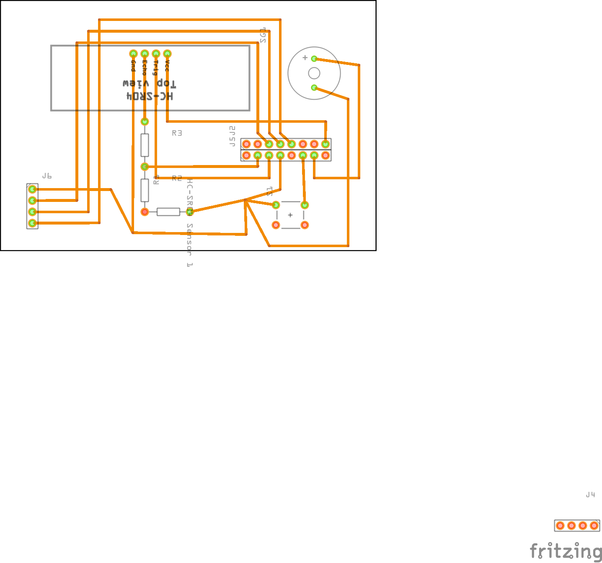

# CovScan

A RPI hack for creating a Covid Scanner

## Introduction

[](https://www.youtube.com/watch?v=WZUVuwk_OJ8)


This project was born out of a not too serious discussion on how to
cope with more stringend Covid-restrictions in Germany. Namely, on how
to automate scanning the European Covid Passport as a door entry system.
After a few iterations, it's reached a level of maturity, where it might
actually be useful to others.

## Hard- & Software

The hardware was determined mostly by what was available already. To
reproduce the project you'll need

* a Raspberry PI Zero
* a wide-angle PI camera module, e.g. https://www.amazon.de/gp/product/B07XL3YVYY/ref=ppx_yo_dt_b_asin_title_o03_s00?ie=UTF8&psc=1
* an adapter camera cable for the PI zero, e.g. https://www.amazon.de/AZDelivery-Flexkabel-Raspberry-Zero-Display/dp/B07CMZ9DV2/ref=sr_1_1_sspa?__mk_de_DE=ÅMÅŽÕÑ&keywords=pi+zero+camera+cable
* three 5 mm LEDs, blue, red and green might be appropriate colors
* six 220Ω resistors
* two 8 pin sockets
* one 4 pin bent pin connector
* a small buzzer
* a HC-SR04  ultra-sonic distance sensor, https://www.amazon.de/gp/product/B091BW1MM3/ref=ppx_yo_dt_b_asin_title_o05_s00?ie=UTF8&psc=1
* a 5 x 7cm prototype PCB board

The software consists of a single python script, which can be found in this
repository. Additional dependencies are required and installation is
detailed below.

## Tools

To follow the instructions you'll need a soldering iron and lead, access to a
3d printer, some cutter pliers, and a selection of jumper wires.

## Preparing the Hardware

I'm a software developer (and recovering physicist), so please don't judge
my soldering skills :) However, the following does work, and you are very
welcome to make comments for improvement.

We will need to solder components on both sides of the PCB board. The
following sketches are for indication only. How you do the actual routing
is a bit up to you. However, to fit the case, you shoudl make sure that
the PI zero, the SR04 and the pin connector for the LEDs are positioned in
the right place on the PCB.


Start off by soldering the 2 8-pin sockets 8 rows from the top edge (so
start in row 9) and 2 columns from the right edge (start in column 3).
This is where the PI will connect to. Then solder the 4-pin connector 2 rows
and to columns away from the lower left edge. Both of these go on the same
side of the PCB.

Next, solder the SR04 7 rows from the top and 5 columns from the left edge
onto the same side as the pin connector. Your buzzer should now go somewhere
in the top right corner.

Now we need to do the actual connection routing. We'll start with implementing
a voltage divider for the output of the SR04. Solder three of the resistors
in sequence originating from the "echo" pin of the SR04. I still did this
on the same side as the previous components, allowing me to route on the
other side then.



Connect the far side of the first resistor to GPIO pin 27 of the PI, which
corresponds to the second pin from the left of the lower row of the 8 pin
connector.

Connect the far end of the last resistor to ground, e.g. to 4th pin from the
left of the lower connector row.

Connect the trigger pin of the SR04 to GPIO 17, which is the third pin from
the left of the lower row.

Finally, connect VCC to a 5V output of the PI, which is e.g. the right-most
pin in the top connector row.

With the SR04 connected we now wire the buzzer. It's ground should be
connected to the ground we used for the SR04. The other pin connects to
GPIO 2, which is the second pin from the right in the lower connector.

Next we connect the power button, which we solder onto the opposite side of
the PCB. It connects to GPIO3 and to ground. It's important to use GPIO3 here
as otherwise the wake functionality of the PI will not work.




Finally, we connect the LED pins. The top-most pin should be connected to
ground. Going down from top to bottom we then connect to GPIO pins 18, 15,
14 respectively, which are the 5th, 4th and 3rd pin from the left,
in the top connector row.

The complete PCB should look like this




## Soldering the LEDs

The system communicates via three LED at the top of the case. The easiest
way to solder these in the right positions is to first directly attach the
resistors to the led, and then use the case as a template for their spacing.
All three LED can share a common base potential, and thus we solder the their
short legs together and will then attach these to a ground pin of the PI
(or rather the 4 pin connector). To keep everything tidy and safe we isolate
each leg individually and then wrap the entire assembly in isolation tape.


# Printing the Housing

I won't give any detailed instructions on how you print the two provided
STL files, as this depends on the 3D printer. On my Any Cubic M3 this worked
without issues in about half a day.


# Preparing the Raspberry PI

Note: Rasbian recently move to a new Debian base, which does not yet
have the same Python library support as the previous Buster version.
Thus we use an the older version for this project.

1. Download the appropriate ISO image: http://downloads.raspberrypi.org/raspios_lite_armhf/images/raspios_lite_armhf-2021-05-28/
2. Use the Raspberry Etcher or any other etcher to burn the image to an SD
   card.

3. setup your PI zero for headless connection to the WIFI: https://www.raspberrypi.com/documentation/computers/configuration.html#configuring-networking31
4. setup ssh connections, by adding an empty file named "ssh" to the boot folder
   of the SD card

Once you are done with these steps, power up the PI and wait for a few minutes.
You should now be able to connect to the system via ssh:

```bash
ssh pi@raspberrypi.local
```

The password is raspberry by default.

# Installing Basic Dependencies

If not already done so, ssh onto your PI. First let's make sure the system
is up-to-date:

```bash
sudo apt-get update && apt-get upgrade -y
```

This will take a few minutes to complete and the PI will need to reboot
afterwards.

Now we can install some basic requirements

```bash
sudo apt-get install -y python3 python3-opencv python3-pip git libzbar0
```

Again this might take a while

## Enabling the Camera

Enter `raspo-config`
```
sudo raspi-config
```

Navigate to `Interfacing Options`, and then select to enable the camera.
Your PI will need to reboot afterwards.

## Cloning this Project and Installing Python Requirments

First clone this project onto your PI

```bash
git clone https://github.com/steffenhauf/covscan.git
```

Now install the remaining requirements:

```bash
cd covscan
sudo pip3 install -r requirements.txt
```

# Putting it all together

With your PI setup (and powered down again), install the camera module
to the PI by connecting the ribbon cable (make sure you have the orientation)
correct. The contacts should be facing away from the camera lens on the
camera module and the cable should be attached to the PI as indicated here:
https://picamera.readthedocs.io/en/release-1.13/quickstart.html.

Attach the LEDs to your connector on the prototype PCB and then attach the
PI to the PCB.

You might want to now consider powering the system and testing that everything
works:

```
sudo python3 covscan/covid-scanner.py
```

This should start the scanner. The red and blue LED should light up,
and the buzzer should buzz if there is someting within 100 cm of the
distance sensor. The QR code scanner should read your vaccination code
from a distance of about 8-10 cm, with the phone centered underneath the
lens, and the green LED should indicate this.

## Integrating into the Housing

With the PI powered down again, gently slide in the PCB module into the groves,
while guiding the cables in, after pushing the LED assembly through the holes.
You will have to twist the camera cable by 180  degrees. This is possible but
needs to be done very gentle, as to avoid  breaking the cable. The camera
module should come to rest in the groves forseen for it.

## Finalizing

All that is missing is that the scanner auto-starts when you power the PI.
For this we add and entry to the end of `/etc/rc.local`:

```
sudo nano /etc/rc.local
```

The last lines should now look like this.

```bash
sudo python3 /home/pi/covscan/covid-scanner.py &
exit 0
```

# ToDos

Putting everything together I noticed some flicker, which might be
due to poor connections (or my soldering skills :) )

More importantly, the housing currently ony fits iPhones well. Especially,
if the buzzer feature is not need a 90° rotated camera view could be
implemented.

